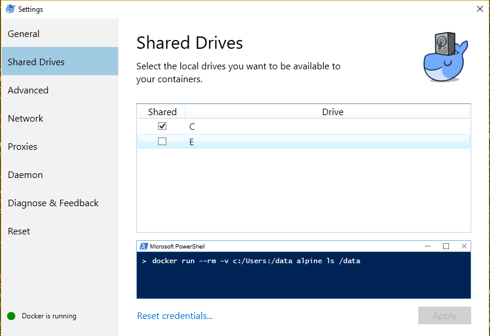

# Hosting docker containers at windows (Python application, kafka and mongodB)

## Overview

In this tutorial we are exploring steps related to hosting docker containers from Windows 10 OS. There are three examples of containers: a python 3.5 application that process data; a [Apache Kafka](https://kafka.apache.org/) queue container to act as a data collector for a data streaming; and a mongodB container to store processed data.

## STEPS

1 - Install [Docker Community Edition](https://store.docker.com/editions/community/docker-ce-desktop-windows) for Windows (tested for Version 18.03.1-ce-win65 (17513)) and follow installation and configuration steps.
    - Remarks: Hyper-V must be enabled at 'Windows features' [see official troubleshooting](https://docs.docker.com/docker-for-windows/troubleshoot/#virtualization)
               Virtualisation must be enabled at BIOS (confirmation of correct set can be done at task manager)


2 - Create account at dockerHub in order to build projects directly from the source.

3 - Set and start kafka container [see more info here](https://kafka.apache.org/quickstart) at PowerShell
  
```bash
docker container run -p 2181:2181 -p 9092:9092 --env ADVERTISED_HOST=localhost --env ADVERTISED_PORT=9092 spotify/kafka
```
3.1 - Create a topic (see 3.2.1 and 3.2.2 steps)

```bash
./kafka-topics.sh --create --zookeeper localhost:2181 --replication-factor 1 --partitions 1 --topic topic_name
```
3.2 - Run kafka producer (kafka input)
3.2.0 - find kafka's container name 
```bash
docker ps
```
3.2.1 - Acess kafka container 
```bash
docker exec -it container_kafka_name bash
```
3.2.2 - go to bin folder where the file kafka-console-producer.sh is found (please see that version may vary in next bash command)
```bash
cd opt/kafka_2.11-0.10.1.0/bin
```
3.2.3 - run kafka producer 
```bash
./kafka-console-producer.sh --broker-list localhost:9092 --topic topic_name 
```

3.3 - Run kafka consumer (kafka output)
3.3.0 - find kafka's container name 
```bash
docker ps
```
3.3.1 - Acess kafka container 
```bash
docker exec -it container_kafka_name bash
```
3.3.2 - go to bin folder where the file kafka-console-consumer.sh is found (please see that version may vary in next bash command)
```bash
cd opt/kafka_2.11-0.10.1.0/bin
```
3.2.3 - run kafka consumer 
```bash
kafka-console-consumer.sh --bootstrap-server localhost:9092 --topic continuous --from-beginning
```

4 - Set mongodB container (and load with dump (restoring info from another database))
    - Remarks: This command creates a volume pointing to a local disk. Thus, it is required to allow drive sharing at docker settings


4.1 - run mongo container with volume pointing to folder that contains database dump in format .tar.gz (27017 is mongo's default port)
```bash
 docker container run -d -p 27017:27017 -v C:\Users\completePath\folderContainingDatabaseDump:/backup mongo 
```
4.2 - go inside container in order to check for dump correct allocation
```bash
 docker container exec -it containerId /bin/bash
```
4.3 - search for files at specified backup folder (this command will return dump's filename)
```bash
 ls /backup/
```
4.4 - untar dump (this will create a folder at container's root containing extracted database dump)
```bash
 tar -zxvf /backup/dumpFilename.tar.gz
```
4.5 - restore database named 'databaseName'
```bash
 mongorestore /databaseFolder -d databaseName
```

5 - Build python processor container (either from dockerHub or from local drive)
```bash
 docker build -t projectName .
```
5.1 - Set environment to connect processor container to kafka's and mongo's containers
```bash
docker run -it --network host --env KAFKA=localhost:9092 --env MONGO_URI=mongodb://localhost:27017 --env MONGO_DATABASE=databaseName projectName
```
### Troubleshooting
In case a container dies just after being intiated run the following command to clean unused volumes, images, etc. 
```bash
docker system prune
```


To do:

- Add filebeat + kibana tutorial to monitor container logs
